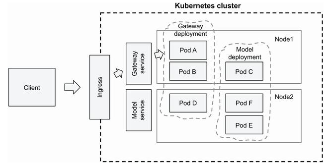

### Deploying DL models
1. Serving models with Tensorflow Serving
2. Model Deployment with Kubernetes
3. Model Deployment with Kubeflow


### Model Deployment with Kubernetes



1. Build the image for TF serving
    ```
    IMAGE_SERVING_LOCAL="tf-serving-clothing-model"
    docker build -t ${IMAGE_SERVING_LOCAL} -f tf-serving.dockerfile .
    ```

2. Gateway Image
    