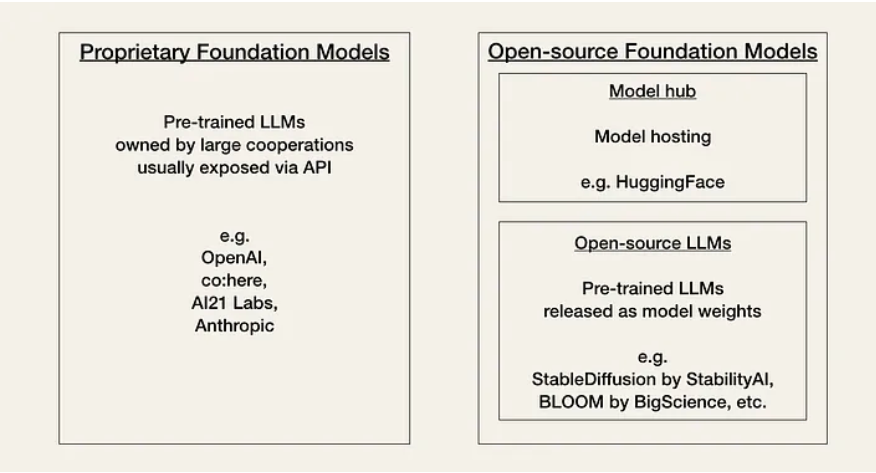

### LLM

1. [Currently, developers have to choose between two types of foundation models based on a trade-off between performance, cost, ease of use, and flexibility: Proprietary models or open-source models.](https://wandb.ai/iamleonie/Articles/reports/Understanding-LLMOps-Large-Language-Model-Operations--Vmlldzo0MDgyMDc2)
