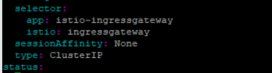
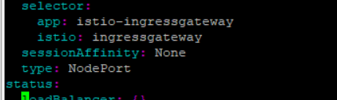
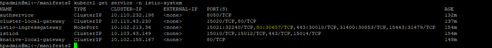
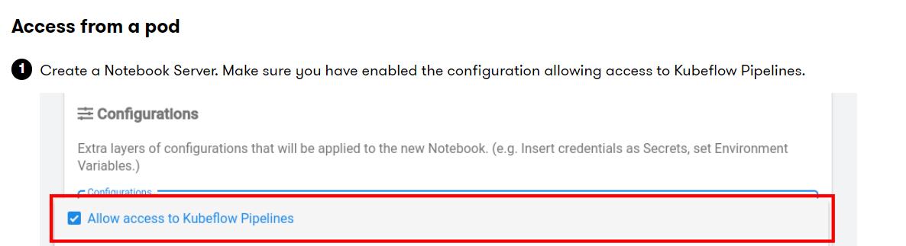

## [Deploying a local Kubeflow setup](https://github.com/kubeflow/manifests)
## Prerequiste
1. Kubernetes 1.25 with default storage class
2. Setup the local storage as  default storage class  
2. Run following crd's
    1. [Install serving creds](https://knative.dev/docs/install/yaml-install/serving/install-serving-with-yaml/#install-the-knative-serving-component)
        ```
        kubectl apply -f https://github.com/knative/serving/releases/download/knative-v1.9.0/serving-crds.yaml
        ```
    2. Run CRD for clusterruntime 
        - Navigate to the `https://github.com/kserve/kserve/tree/master/config/crd`
        - Download the yaml  serving.kserve.io_clusterservingruntimes.yaml
        -  Run the yaml
            ```
            Kubectl apply -f serving.kserve.io_clusterservingruntimes.yaml
            ```
### kustomize 5.0.3

1. Install Kustomize v 5.0.3

1. Download the tar file 
    ```
    wget https://github.com/kubernetes-sigs/kustomize/releases/download/kustomize%2Fv5.0.3/kustomize_v5.0.3_linux_amd64.tar.gz
   
    ```
2. move to the PATH location
    ```
    sudo tar xvf kustomize_v5.0.3_linux_amd64.tar.gz -C /usr/local/bin
    ```

### [Install using single command](https://github.com/kubeflow/manifests/tree/master#prerequisites)
1. Install Kustomize 5.03
    ```
    wget https://github.com/kubernetes-sigs/kustomize/releases/download/v3.2.0/kustomize_3.2.0_linux_amd64
    ```
    - Move the binary to the `/usr/local/bin`
    ```
    sudo chmod a+x kustomize_3.2.0_linux_amd64 &&     sudo mv kustomize_3.2.0_linux_amd64 /usr/local/bin/kustomize
    ```
2.  Validate the version
    ```
    kustomize version
    ```

3. Run Kubelfow in single line
    - Clone the manifest github repo
        ```
        git clone https://github.com/kubeflow/manifests
        ```
    - `cd` in manifest folder

    -  [Edit the Jupyter deployment yaml file](https://github.com/kubeflow/kubeflow/issues/5763)
        1. [If you will not edit the yaml file then you will not able to create the jupyter notebook](https://github.com/kubeflow/manifests#nodeport--loadbalancer--ingress)
        
        ```
        while ! kustomize build example | kubectl apply -f -; do echo "Retrying to apply resources"; sleep 10; done

        ```

5. Validate the pods.
    ```
    kubectl get pods -n cert-manager
    kubectl get pods -n istio-system
    kubectl get pods -n auth
    kubectl get pods -n knative-eventing
    kubectl get pods -n knative-serving
    kubectl get pods -n kubeflow
    kubectl get pods -n kubeflow-user-example-com
    ```
### Install individual components for advance users

1.  execute the shell script [Individual-component.sh](C:\Users\sharsaur\na-ai-projects\kubeflow\individual-component.sh)
    ```
    sh individual-component.sh
    ```
17. Validate all the pods are in running state
    ```
    kubectl get pods -n cert-manager
    kubectl get pods -n istio-system
    kubectl get pods -n auth
    kubectl get pods -n knative-eventing
    kubectl get pods -n knative-serving
    kubectl get pods -n kubeflow
    kubectl get pods -n kubeflow-user-example-com
    ```
### Access the cluster
1. Port forward
    ```
    kubectl port-forward svc/istio-ingressgateway -n istio-system 8087:80
    ```
    - Navigate to the `http://localhost:8087`

2. Access at Ip address
    - Edit the service istio-ingressgateway
    ```
    kubectl edit service istio-ingressgateway -n istio-system
    ```
    - Change the type of service from `ClusterIP` to `NodePort`
    -   
    to 
    -   

3. Get the Port number of service
    - Service port
        ```
        kubectl get service -n istio-system
        ```
      
4. Navigate to the 
    - `<ip addres of node>:<port number>`
    - 
    - In our case
        `10.10.162.165:30657`
5. Login credentials
    - username: user@example.com
    - password: 12341234

### Access to Minio

1. Get the access key and password
    ```
    Kubectl get service -n kubeflow
    kubectl edit  service minio-service  -n kubeflow
    ```
2. Change the type of service from `ClusterIP` to `NodePort`


3. Create a config-map in the namespace you're using with the docker config
    ```
    kubectl create --namespace kubeflow-user-example-com configmap docker-config --from-file=config.json
    ```


### Create Kubeflow pipeline
1. [Inject Poddefault](https://www.kubeflow.org/docs/components/pipelines/v1/sdk/connect-api/#full-kubeflow-subfrom-inside-clustersub)
2. update the namespace in [manifest file](podefault.yaml)
3. Execute
    ```
    kubectl apply -f poddefault.yaml
    ```
4. Login to the kubeflow dashboard
5. Create jupyter notebook
    
2. Clone the kubelfow examples
    ```
    git clone https://github.com/kubeflow/examples.git
    ```

### Delete the entire components
1. Delete the stack 
    - Delete from manifest files
    ```
     kustomize build example | kubectl delete -f -
    ```
    - You will see namespaces will be in terminating state and we have to forcefully delete the ns.
    - start the kubectl proxy in different cli 
        ```
        kubectl proxy
        ```
    - Execute below for loop. Add or delete the ns as per need

        ```
        (
        for NAMESPACE in knative-eventing kubeflow knative-serving auth istio-system cert-manager kubeflow-user-example-com kserve kserve-test
        do
            kubectl get namespace $NAMESPACE -o json |jq '.spec = {"finalizers":[]}' >temp.json
            curl -k -H "Content-Type: application/json" -X PUT --data-binary @temp.json 127.0.0.1:8001/api/v1/namespaces/$NAMESPACE/finalize
        done
        )
        ```
    - delete the pods forcefully
        ```
        kubectl delete --all pod --grace-period=0 --force --namespace <NAMESPACE>
        ```
    - delete the pvc which is in terminating state
        ```
        kubectl patch pvc {PVC_NAME} -p '{"metadata":{"finalizers":null}}'
        ```

        
### Kubeflow 1.5
1. Prerequiste
    1. Kubernetes 1.21 with default storage class
    2. Kustomize 3.2
    3. [Manifest file](https://github.com/kubeflow/manifests/tree/v1.5-branch)
        1. file path
        ```
        vi apps/jupyter/jupyter-web-app/upstream/base/deployment.yaml
        ```
        2. Second file
        ```
        vi apps/volumes-web-app/upstream/base/deployment.yaml
        ```
    5. Run in single line
        ```
        while ! kustomize build example | kubectl apply -f -; do echo "Retrying to apply resources"; sleep 10; done
        ```
### ERRORS 
1. Error if we dont install CRD's
    ```
    Error from server (InternalError): error when creating "STDIN": Internal error occurred: failed calling webhook "webhook.cert-manager.io": failed to call webhook: Post "https://cert-manager-webhook.cert-manager.svc:443/mutate?timeout=10s": dial tcp 10.102.112.107:443: connect: connection refused
    ```
2.  Error for clusterruntime server
      
3.  Error 
    ```
    error: resource mapping not found for name: "queue-proxy" namespace: "knative-serving" from "STDIN": no matches for kind "Image" in version "caching.internal.knative.dev/v1alpha1"
    ensure CRDs are installed first
    ```
Reference Video to install Kubeflow: https://www.youtube.com/watch?v=5E-r_0MGZ20