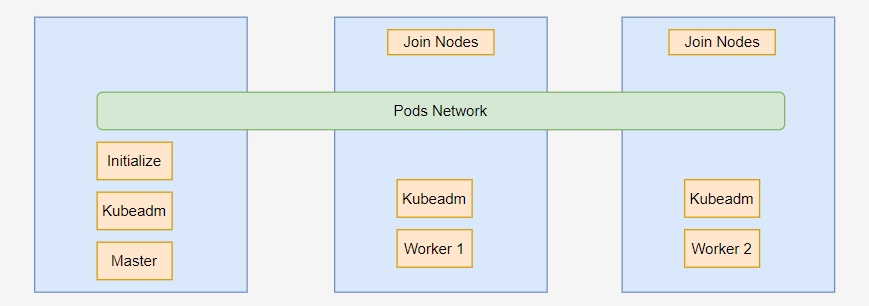
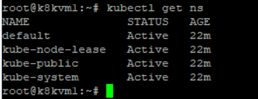

# Kubernetes on Ubuntu 20.04
  
## Install and configure prerequisites

### Install Docker on all nodes
1. Install the docker engine
    1. Install using the convenience script
        ```
        curl -fsSL https://get.docker.com -o get-docker.sh
        sudo sh get-docker.sh
        ```
    2. Add the user to the docker group
        ```
        sudo usermod -aG docker <username>
        ```
    3. Run the hello world
        ```
        sudo docker run hello-world
        ```
2. [Optional- Install docker compose](https://docs.docker.com/compose/install/linux/#install-using-the-repository)
### Container runtime interface on all nodes

1. Setup the container runtime interface
    - there are various option of CRI
        - containerd
        - CRI-O
        - Docker Engine
        - Mirantis Container Runtime(cri-dockered)

2. Installation of Mirantis Container Runtime.
    - [Forwarding IPv4 and letting iptables see bridged traffic](https://kubernetes.io/docs/setup/production-environment/container-runtimes/#forwarding-ipv4-and-letting-iptables-see-bridged-traffic)

    ```
        cat <<EOF | sudo tee /etc/modules-load.d/k8s.conf
        overlay
        br_netfilter
        EOF

        sudo modprobe overlay
        sudo modprobe br_netfilter

        # sysctl params required by setup, params persist across reboots
        cat <<EOF | sudo tee /etc/sysctl.d/k8s.conf
        net.bridge.bridge-nf-call-iptables  = 1
        net.bridge.bridge-nf-call-ip6tables = 1
        net.ipv4.ip_forward                 = 1
        EOF

        # Apply sysctl params without reboot
        sudo sysctl --system
    ```
    - Verify that the br_netfilter, overlay modules are loaded by running the following commands:
    ```
    lsmod | grep br_netfilter
    lsmod | grep overlay
    ```
    - Verify that the net.bridge.bridge-nf-call-iptables, net.bridge.bridge-nf-call-ip6tables, and net.ipv4.ip_forward system variables are set to 1 in your sysctl config by running the following command:
    ```
    sysctl net.bridge.bridge-nf-call-iptables net.bridge.bridge-nf-call-ip6tables net.ipv4.ip_forward
    ```
### Install CRI-Dockerd

1. Installation
    - Download the binary of cri-dockerd for amd
     ```
     wget https://github.com/Mirantis/cri-dockerd/releases/download/v0.3.4/cri-dockerd-0.3.4.amd64.tgz
     ```
    - Download the binary for ARM
    ```
    wget
    https://github.com/Mirantis/cri-dockerd/releases/download/v0.3.4/cri-dockerd-0.3.4.arm64.tgz
    ```
    - Untar the file and move to untar file
    ```
    tar xvf cri-dockerd-0.3.4.amd64.tgz
    sudo mv cri-dockerd/cri-dockerd /usr/local/bin/
    ```
    - check the docker version
    ```
    cri-dockerd --version
    ```
    - configure the system setting
    
    ```
    wget https://raw.githubusercontent.com/Mirantis/cri-dockerd/master/packaging/systemd/cri-docker.service
    wget https://raw.githubusercontent.com/Mirantis/cri-dockerd/master/packaging/systemd/cri-docker.socket
    sudo mv cri-docker.socket cri-docker.service /etc/systemd/system/
    sudo sed -i -e 's,/usr/bin/cri-dockerd,/usr/local/bin/cri-dockerd,' /etc/systemd/system/cri-docker.service
    ```
    - Start the service
    ```
    sudo systemctl daemon-reload
    sudo systemctl enable cri-docker.service
    sudo systemctl enable --now cri-docker.socket
    ```
    - Confirm the service
    ```
    systemctl status cri-docker.socket
    ```

2. Disable  swap
    ```
    swapoff -a 
    ```
    `Edit /etc/fstab and comment out swap line`
    
## Installing kubeadm, kubelet and kubectl
1. Execute below commands to update and  download keys. [Refer this document if you face any issue in downloading keys](https://kubernetes.io/docs/tasks/tools/install-kubectl-linux/#install-using-native-package-management) 
    ```
    sudo apt-get update
    # apt-transport-https may be a dummy package; if so, you can skip that package
    sudo apt-get install -y apt-transport-https ca-certificates curl
    curl -fsSL https://pkgs.k8s.io/core:/stable:/v1.28/deb/Release.key | sudo gpg --dearmor -o /etc/apt/keyrings/kubernetes-apt-keyring.gpg
    echo 'deb [signed-by=/etc/apt/keyrings/kubernetes-apt-keyring.gpg] https://pkgs.k8s.io/core:/stable:/v1.28/deb/ /' | sudo tee /etc/apt/sources.list.d/kubernetes.list
    ```
2. [Choose the latest version or previous version of kubeadm, kubectl and kubelet](https://kubernetes.io/docs/setup/production-environment/tools/kubeadm/install-kubeadm/#dpkg-k8s-package-repo)
    ```
    sudo apt-get install -y kubelet kubeadm kubectl
    sudo apt-mark hold kubelet kubeadm kubectl
    ````
    - Optional to install previous version
        - if you want to remove the old version of kubeadm, kubectl, kubelet
            ```
            sudo apt-get remove kubelet kubeadm kubectl
            ```
            - Install specific version
                ```
              sudo apt-get update
              sudo apt-get install -y kubelet kubeadm kubectl
              sudo apt-mark hold kubelet kubeadm kubectl
                ```
### K8 Master Node
1. Initialize the kubernetes with single control plane node
    ```
    sudo kubeadm init --upload-certs
    ```
    - If you get error to find the container run time then please pass the below argument `--cri-socket`
        ```
       sudo  kubeadm init --upload-certs --cri-socket="unix:///var/run/cri-dockerd.sock"
        ```
2. [Optional] Initialize the cluster with HA(multiple control plane nodes)
    ```
    sudo kubeadm init --upload-certs --control-plane-endpoint="10.10.160.126" --cri-socket="unix:///var/run/cri-dockerd.sock"
    ```
    or with domain name
    ```
    kubeadm init --upload-certs --control-plane-endpoint="m1.ailab.local" --cri-socket="unix:///var/run/cri-dockerd.sock"
    ```
2. Run following commands
    ```
      mkdir -p $HOME/.kube
      sudo cp -i /etc/kubernetes/admin.conf $HOME/.kube/config
      sudo chown $(id -u):$(id -g) $HOME/.kube/config
      
    ```
    if we are root user
    ```
    export KUBECONFIG=/etc/kubernetes/admin.conf
    ```
3. Untained the master node if required
    - get the value of node name

    ```
    kubectl get nodes
    ```
    - Verify Taint value matches the value in below command
    ``` 
    kubectl taint node <master node name> node-role.kubernetes.io/control-plane:NoSchedule-
    ```
3. Install the network addon
    ```
     kubectl apply -f https://github.com/weaveworks/weave/releases/download/v2.8.1/weave-daemonset-k8s.yaml
     ```
3. [Optional for multiple nodes]Copy the join statement  for control plane and execute if you want to have multiple control plane( `kubeadm token create --print-join-command`). below is the output of the init statement.
    ```
    Your Kubernetes control-plane has initialized successfully!

    To start using your cluster, you need to run the following as a regular user:

    mkdir -p $HOME/.kube
    sudo cp -i /etc/kubernetes/admin.conf $HOME/.kube/config
    sudo chown $(id -u):$(id -g) $HOME/.kube/config

    Alternatively, if you are the root user, you can run:

    export KUBECONFIG=/etc/kubernetes/admin.conf

    You should now deploy a pod network to the cluster.
    Run "kubectl apply -f [podnetwork].yaml" with one of the options listed at:
    https://kubernetes.io/docs/concepts/cluster-administration/addons/

    You can now join any number of the control-plane node running the following command on each as root:

    kubeadm join 10.10.160.126:6443 --token 62szvp.ux5861a2r44nid7m \
            --discovery-token-ca-cert-hash sha256:85977c42f8e1bf99afa94b1cb5ef96d40c0dde6e24b37edc5861a63806566032 \
            --control-plane --certificate-key 88e436d684420c8bec4e1a20c64b209fbf4ab48af4a148661512aae2ae69aa2a

    Please note that the certificate-key gives access to cluster sensitive data, keep it secret!
    As a safeguard, uploaded-certs will be deleted in two hours; If necessary, you can use
    "kubeadm init phase upload-certs --upload-certs" to reload certs afterward.

    Then you can join any number of worker nodes by running the following on each as root:

    kubeadm join 10.10.160.126:6443 --token 62szvp.ux5861a2r44nid7m \
            --discovery-token-ca-cert-hash sha256:85977c42f8e1bf99afa94b1cb5ef96d40c0dde6e24b37edc5861a63806566032
    ```

### k8 Worker node
1. Execute in each worker node
    ```
    kubeadm join 10.10.160.126:6443 --token q2ofwh.4fubbapq4v23d7bp --discovery-token-ca-cert-hash sha256:17d512f6cc6669479b2051d34df03c118622787f746a3119197aa444e3f7d829 --cri-socket unix:///var/run/cri-dockerd.sock
    ```
2. ssh into master and validate two workers should be running
    ```
    kubectl get nodes
    ```
### Validate the kubernetes
1. You should see the following namespaces
    ```
    kubectl get ns
    ```
      

### Autocompletion 
1. install bash-completion
    ```
    apt-get install bash-completion
    ```
2.  ```
    echo 'source <(kubectl completion bash)' >>~/.bashrc
    source ~/.bashrc
    ```


### Remove namespace which are stuck in terminating state

1. Install JQ
    - Ubuntu 
        ```
        sudo apt-get install jq
        ```
2. Remove the namespace. Replace the namespace which you awa
    ```
    (
    NAMESPACE=auth
    kubectl proxy &
    kubectl get namespace $NAMESPACE -o json |jq '.spec = {"finalizers":[]}' >temp.json
    curl -k -H "Content-Type: application/json" -X PUT --data-binary @temp.json 127.0.0.1:8001/api/v1/namespaces/$NAMESPACE/finalize
    )
    ```


### Install docker registry
1. Create docker registry server on any free node.
    ```
    docker run -d -p 9002:5000 --restart=always --name registry registry:2
    ```

    ```
    docker run -d -p 9001:5000 --restart=always -e REGISTRY_PROXY_REMOTEURL="https://registry-1.docker.io"  --name through-cache registry:2
    ```

2. Edit the daemon.json file.
    `vi /etc/docker/daemon.json`
    ```
    {
        "exec-opts": ["native.cgroupdriver=systemd"],
        "registry-mirrors": ["http://10.10.162.143:9001"],
    "insecure-registries": ["http://10.10.162.143:9002"]
    }
    ```
3. Restart the docker
    ```
    systemctl restart docker
    ```


### Add the docker registry
1. If you want to add the docker private registry. Add following in daemon.json file.
    ```
        {
            "runtimes": {
                "nvidia": {
                    "path": "nvidia-container-runtime"
                }
            },
        "registry-mirrors": ["http://10.10.162.143:9001"],
        "insecure-registries": ["http://10.10.162.143:9002"]
        }


    ```    

### [Add the metric server](https://github.com/kubernetes-sigs/metrics-server)
1. [Add the arguments in the component.yaml file](https://stackoverflow.com/questions/57137683/how-to-troubleshoot-metrics-server-on-kubeadm)
## Errors
1. [X509 error certificate error.](https://stackoverflow.com/questions/36939381/x509-certificate-signed-by-unknown-authority-kubernetes)
2. Uninstall Kubernetes
    ```
    sudo kubeadm reset --cri-socket="unix:///var/run/cri-dockerd.sock"
    sudo apt-get purge kubeadm kubectl kubelet kubernetes-cni kube*   -y
    sudo apt-get autoremove   -y
    sudo rm -rf ~/.kube
    ```
3. Remove the conflicting keys for nvidia driver
    https://developer.nvidia.com/blog/updating-the-cuda-linux-gpg-repository-key/

    Also check for and remove cuda*.list files under the /etc/apt/sources.d/ directory.  
4. If there is any broken packages in Ubuntu and which doesnot meet the dependencies.
    Execute the following command
    ```
    sudo apt-get -f install
    ```
